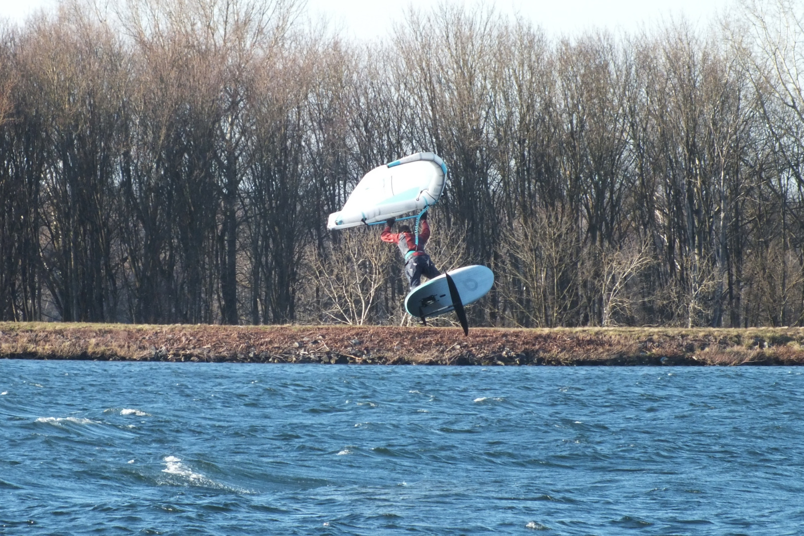

# Welcome, I'm Tristan 👋

📍 **Bühl, Germany** | 💻 **Software Craftsman** | 🏢 **[Teufel IT](https://teufel-it.de)**

I’m a **Software Architect & Developer Experience Expert.** I enjoy building things that make development less painful and systems more resilient.
Currently doing some heavy lifting in enterprise environments, but always keeping my hands dirty with Open Source.

## Specialized Consulting

I help companies bridge the gap between complex requirements and maintainable, high-quality software.
With a decade of enterprise experience and deep developer tooling knowledge, I make your codebase an asset, not a liability.

How I can support your team:
- **Architecture & Strategic Consulting**: expert feedback on system design and scaling modern software ecosystems.
- **Modernization & Refactoring**: migrate legacy codebases to modern, clean, testable, high-performance stacks.
- **Developer Experience & Tooling**: build testing and automation infrastructure based on my experience with thousands of users. I help teams build resilient systems and scale developer velocity.

Let's build something that lasts.

 

## Things I built because I needed them

### PWA's
- 🖥️ **[ccu-addon-mui](https://github.com/firsttris/ccu-addon-mui)** - Modern PWA UI for HomeMatic CCU3 with dashboards and device control
- 🗄️ **[snapraid-ui](https://github.com/firsttris/snapraid-ui)** - Clean web dashboard for SnapRAID status, sync, and scrub
- 💨 **[reactive-volcano-app](https://github.com/firsttris/reactive-volcano-app)** - Bluetooth control panel for Storz & Bickel vaporizers
- ✈️ **[Flugwetterdaten](https://github.com/firsttris/Flugwetterdaten)** - METAR/TAF viewer and flight weather data for Baden-Airpark
- 📄 **[astro-cv](https://github.com/firsttris/astro-cv)** - CV site built with Astro and a content-first layout
- 🌐 **[teufel-it-astro](https://github.com/firsttris/teufel-it-astro)** - Teufel IT website built with Astro, optimized for speed

### Chrome Extensions
- 🎬 **[chrome.sendtokodi](https://github.com/firsttris/chrome.sendtokodi)** - Send web video streams to Kodi with one click
- 🧹 **[oneclickhistorycleaner](https://github.com/firsttris/oneclickhistorycleaner)** - One-click browsing history cleaner for Chrome

### VSCode Extensions
- 🧪 **[vscode-jest-runner](https://github.com/firsttris/vscode-jest-runner)** - The industry-standard Test integration for VS Code. High-performance test orchestration used by thousands of developers to maintain velocity in complex Monorepos.
- 📦 **[vscode-distrobox-reveal](https://github.com/firsttris/vscode-distrobox-reveal)** - Reveal Folder in Host Explorer from Distrobox containers directly in VS Code
- 🗣️ **[vscode-speech-language-switch](https://github.com/firsttris/vscode-speech-language-switch)** - Quickly switch VS Code speech recognition language

### Kodi Plugins
- 📺 **[plugin.video.sendtokodi](https://github.com/firsttris/plugin.video.sendtokodi)** - Stream URLs to Kodi using yt-dlp
- 🏠 **[repository.sendtokodi](https://github.com/firsttris/repository.sendtokodi)** - Kodi repository for SendToKodi add-ons

### Smart Home
- ⚡ **[esphome-energy-dashboard](https://github.com/firsttris/esphome-energy-dashboard)** - ESPHome-based energy dashboard with realtime charts
- 🧵 **[esp32c6-thread-router](https://github.com/firsttris/esp32c6-thread-router)** - ESP32-C6 Thread router to extend mesh coverage
- 📡 **[esp32c6-zigbee-router](https://github.com/firsttris/esp32c6-zigbee-router)** - ESP32-C6 Zigbee router to extend network coverage

### Tools

- 📞 **[snom-xml](https://github.com/firsttris/snom-xml)** - Sync Google Contacts to Snom IP phones via XML

### Archived Projects
- 📡 **[mfrc522-rpi](https://github.com/firsttris/mfrc522-rpi)** - MFRC522 RFID control library for Raspberry Pi
- 📦 **[html-webpack-multi-build-plugin](https://github.com/firsttris/html-webpack-multi-build-plugin)** - Webpack plugin for modern/legacy dual builds
- 🏠 **[node-red-contrib-homematic](https://github.com/firsttris/node-red-contrib-homematic)** - Node-RED nodes for Homematic devices
- 💾 **[urbackup-docker](https://github.com/firsttris/urbackup-docker)** - Docker image for UrBackup server
- ⏱️ **[react-track](https://github.com/firsttris/react-track)** - Time tracking app with simple reporting
- 📹 **[chrome.ipcamviewer](https://github.com/firsttris/chrome.ipcamviewer)** - Chrome IP camera viewer and monitor

## What I'm known for:

🚀 vscode-jest-runner: My contribution to the JS testing ecosystem. Used by thousands of developers to keep their Testing flow smooth.

🏠 IoT & Hardware: Hacking everything from HomeMatic to Bluetooth-controlled devices. If it has an API (or I can reverse-engineer one), I’ll automate it.

🏗️ Clean Architecture: I’m a big believer in code that stays maintainable even when the requirements go wild.

## Beyond Coding: Catch Me Wingfoiling on Rivers

## Connect

---
