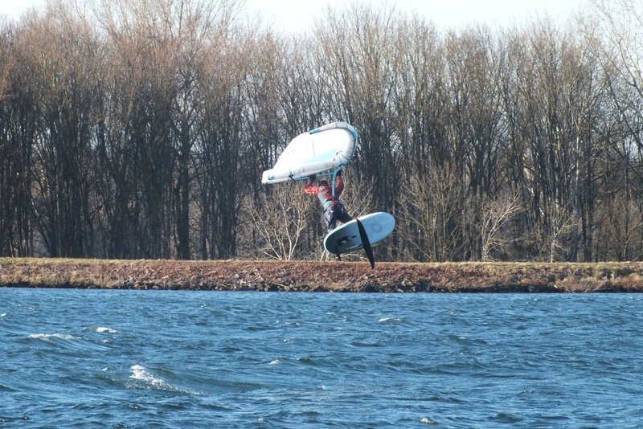

# Welcome, I'm Tristan 👋

📍 **Bühl, Germany** | 💻 **Software Craftsman** | 🏢 **[Teufel IT](https://teufel-it.de)**

I’m a **Software Craftsman** with a focus on architecture and developer experience. I enjoy building things that make development less painful and systems more resilient.
Currently doing some heavy lifting in enterprise environments, but always keeping my hands dirty with Open Source.

## Specialized Consulting

I help companies bridge the gap between complex requirements and maintainable, high-quality software.
With a decade of enterprise experience and deep developer tooling knowledge, I make your codebase an asset, not a liability.

How I can support your team:
- **Architecture & Strategic Consulting**: expert feedback on system design and scaling modern software ecosystems.
- **Modernization & Refactoring**: migrate legacy codebases to modern, clean, testable, high-performance stacks.
- **Developer Experience & Tooling**: build testing and automation infrastructure, drawing on years of maintaining developer tools used by thousands of developers.

📅 **Available for new projects from January 2027.**

Past projects and references: see my [CV](https://cv.teufel-it.de).

Let's build something that lasts.

 

## What I'm known for

🧪 **[vscode-jest-runner](https://github.com/firsttris/vscode-jest-runner)**: run and debug Jest, Vitest, Rstest, Node.js, Bun, Deno and Playwright tests right from VS Code. **2.2M+ installs** on the VS Code Marketplace, maintained since 2017.

📺 **[plugin.video.sendtokodi](https://github.com/firsttris/plugin.video.sendtokodi)**: stream almost any video site to Kodi via yt-dlp. 200+ stars.

## Things I built because I needed them

### Self-hosted & Homelab
- 🏷️ **[namarr](https://github.com/firsttris/namarr)** - Self-hosted renamer for movies, series and anime with preview and undo
- 📥 **[haul](https://github.com/firsttris/haul)** - Self-hosted download manager for file hosters, built with Rust
- 🎛️ **[quadeck](https://github.com/firsttris/quadeck)** - Zero-config dashboard for Podman servers with Quadlets, shipped as a single binary
- 🗄️ **[snapraid-ui](https://github.com/firsttris/snapraid-ui)** - Clean web dashboard for SnapRAID status, sync, and scrub
- 🧾 **[haben](https://github.com/firsttris/haben)** - Self-hosted bookkeeping for freelancers with ELSTER VAT returns (work in progress)

### PWAs
- 🖥️ **[ccu-addon-mui](https://github.com/firsttris/ccu-addon-mui)** - Modern PWA UI for HomeMatic CCU3 with dashboards and device control
- 💨 **[reactive-volcano-app](https://github.com/firsttris/reactive-volcano-app)** - Bluetooth control panel for Storz & Bickel vaporizers
- ✈️ **[Flugwetterdaten](https://github.com/firsttris/Flugwetterdaten)** - METAR/TAF viewer and flight weather data for Baden-Airpark
- 📄 **[astro-cv](https://github.com/firsttris/astro-cv)** - CV site built with Astro and a content-first layout
- 🌐 **[teufel-it-astro](https://github.com/firsttris/teufel-it-astro)** - Teufel IT website built with Astro, optimized for speed

### Desktop Apps
- 🍷 **[prefixr](https://github.com/firsttris/prefixr)** - Native Linux app for managing Wine and Proton prefixes, built with Tauri, SvelteKit and Rust

### VS Code Extensions
- 🧪 **[vscode-jest-runner](https://github.com/firsttris/vscode-jest-runner)** - Run and debug tests for all major JS runtimes and frameworks from your editor
- 📦 **[vscode-distrobox-reveal](https://github.com/firsttris/vscode-distrobox-reveal)** - Reveal Folder in Host Explorer from Distrobox containers directly in VS Code
- 🗣️ **[vscode-speech-language-switch](https://github.com/firsttris/vscode-speech-language-switch)** - Quickly switch VS Code speech recognition language

### Chrome Extensions
- 🎬 **[chrome.sendtokodi](https://github.com/firsttris/chrome.sendtokodi)** - Send web video streams to Kodi with one click
- 🧹 **[oneclickhistorycleaner](https://github.com/firsttris/oneclickhistorycleaner)** - One-click browsing history cleaner for Chrome

### Kodi Plugins
- 📺 **[plugin.video.sendtokodi](https://github.com/firsttris/plugin.video.sendtokodi)** - Stream URLs to Kodi using yt-dlp
- 🏠 **[repository.sendtokodi](https://github.com/firsttris/repository.sendtokodi)** - Kodi repository for SendToKodi add-ons

### Smart Home
- ⚡ **[esphome-energy-dashboard](https://github.com/firsttris/esphome-energy-dashboard)** - ESPHome-based energy dashboard with realtime charts
- 🧵 **[esp32c6-thread-router](https://github.com/firsttris/esp32c6-thread-router)** - ESP32-C6 Thread router to extend mesh coverage
- 📡 **[esp32c6-zigbee-router](https://github.com/firsttris/esp32c6-zigbee-router)** - ESP32-C6 Zigbee router to extend network coverage

### Tools
- 📞 **[snom-xml](https://github.com/firsttris/snom-xml)** - Sync Google Contacts to Snom IP phones via XML

<b>Archived Projects</b>

- 📡 **[mfrc522-rpi](https://github.com/firsttris/mfrc522-rpi)** - MFRC522 RFID control library for Raspberry Pi
- 📦 **[html-webpack-multi-build-plugin](https://github.com/firsttris/html-webpack-multi-build-plugin)** - Webpack plugin for modern/legacy dual builds
- 🏠 **[node-red-contrib-homematic](https://github.com/firsttris/node-red-contrib-homematic)** - Node-RED nodes for Homematic devices
- 💾 **[urbackup-docker](https://github.com/firsttris/urbackup-docker)** - Docker image for UrBackup server
- ⏱️ **[react-track](https://github.com/firsttris/react-track)** - Time tracking app with simple reporting
- 📹 **[chrome.ipcamviewer](https://github.com/firsttris/chrome.ipcamviewer)** - Chrome IP camera viewer and monitor

## Connect

## Off the keyboard

When I'm not coding, you'll find me on the water 🌊

